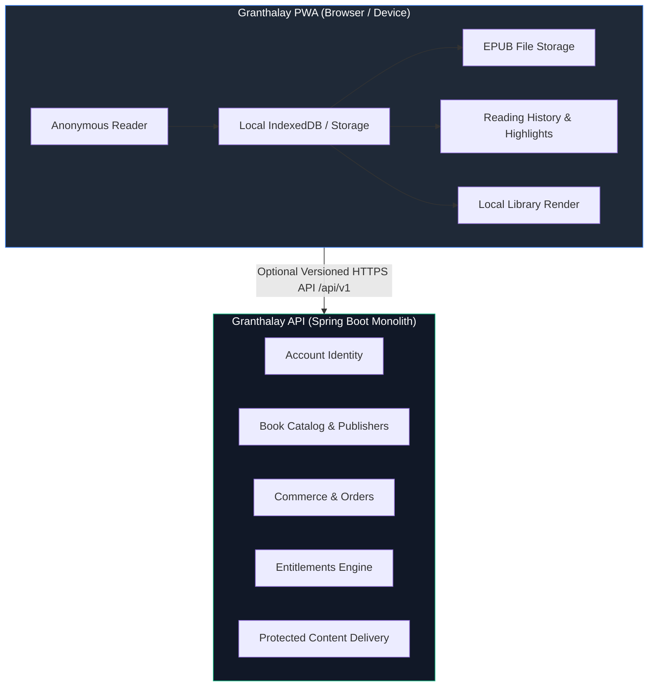

# Vision and Boundaries

## Product Philosophy

**Granthalay** is designed around a **local-first reading philosophy**. 

The static Progressive Web Application (PWA) operates autonomously in the reader's browser. Personal EPUB book imports, reading progress, bookmarks, highlights, and custom reading preferences remain strictly device-local by default. The reader does not need an account or network connectivity to read their personal digital library.

The **Granthalay API** is a separately deployed Spring Boot modular monolith backend that provides **optional connected features**:
- User accounts and authentication sessions.
- Curated catalog and publisher metadata.
- Content publishing and protected EPUB delivery.
- Orders, payment callbacks, and entitlement decisions.
- Multi-device sync and notifications.

---

## Responsibility Boundary

---

## Non-Negotiable Product Constraints

1. **Local Independence**: The PWA must degrade gracefully when the API backend is unreachable. The reader must never be locked out of their personal offline books due to a backend outage.
2. **Entitlement Enforcement**: Purchased or restricted digital content is delivered only after a verified entitlement decision by the backend and is never bundled statically into the frontend asset host.
3. **Privacy First**: User credentials, access tokens, payment credentials, personal identity data, and book content must **never** appear in application logs or external telemetry.
