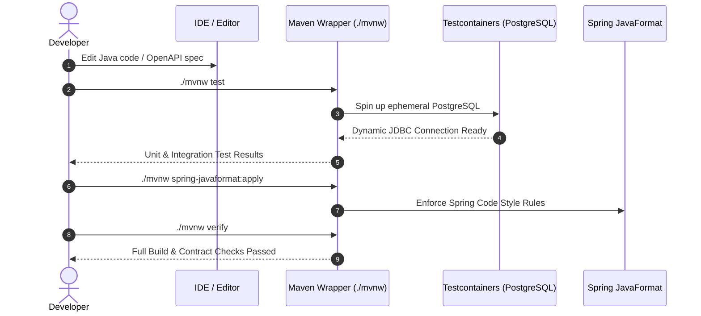

# Developer Guide

This guide details local environment setup, build pipelines, testing standards, and inner-loop developer workflows for **Granthalay API**.

---

## Prerequisites

- **Java**: JDK 25 (Temurin recommended).
- **Build Tool**: Apache Maven (via included `./mvnw` wrapper).
- **Container Engine**: Podman or Docker daemon for Testcontainers integration tests and container builds.

---

## Developer Inner-Loop Workflow



---

## Common Developer Commands

### 1. Run Unit & Modulith Tests
Runs narrow unit tests and Spring Modulith module architecture verification:
```bash
./mvnw test
```

### 2. Run Full Integration Tests (Testcontainers)
Runs all unit and integration tests (`DatabaseIT`, `HealthEndpointIT`, `ApiContractIT`) against a containerized PostgreSQL instance:

**For Podman users:**
```bash
DOCKER_HOST=unix:///run/user/$UID/podman/podman.sock TESTCONTAINERS_RYUK_DISABLED=true ./mvnw verify
```

**For Docker users:**
```bash
./mvnw verify
```

### 3. Apply Code Formatting
Enforces official Spring Framework code formatting rules:
```bash
./mvnw spring-javaformat:apply
```

### 4. Validate Docker Compose Stack
Validates service definitions and environment syntax in `compose.yaml`:
```bash
podman compose config
# or
docker compose config --quiet
```

### 5. Validate Kubernetes Manifests
Validates OCI Kubernetes manifests offline using Kustomize:
```bash
kubectl kustomize k8s/ > /dev/null
```
