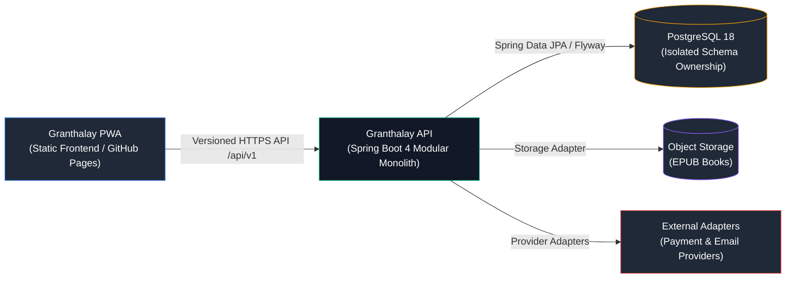
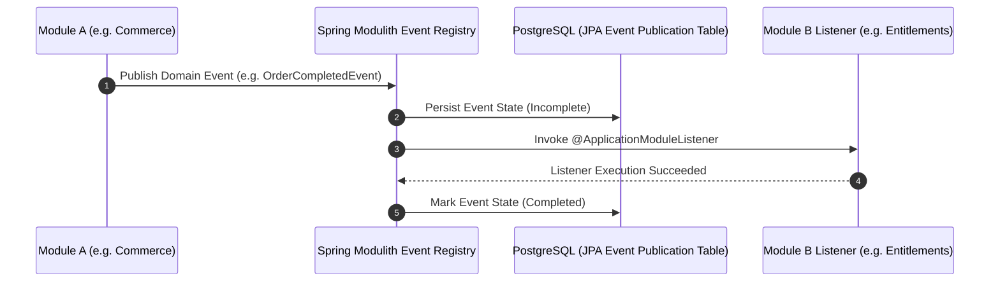

# Architecture

## System Context & C4 Container Diagram

The backend is built as a **Spring Modulith modular monolith** within a single application artifact and PostgreSQL database.

---

## Modulith Architecture & Event Publication Flow

Modules must remain decoupled. Modules interact using **published internal application APIs** or **domain events**. Cross-module direct invocation of another module's repository or entity is forbidden and checked by ArchUnit (`ModuleArchitectureTests`).

---

## Foundation Modules

1. **`identity`**: User accounts, revocable browser sessions (`SESSION` cookie), credentials.
2. **`catalog`**: Book catalog metadata, authors, genres, public listings.
3. **`publishing`**: Publisher accounts, content submissions, publishing workflows.
4. **`storage`**: Content file storage integration behind replaceable adapters.
5. **`commerce`**: Orders, checkout flows, payment provider webhook callbacks.
6. **`entitlements`**: Authorization decisions determining book ownership and access.
7. **`delivery`**: Secure, authenticated EPUB book content streaming.
8. **`operations`**: Operational health probes, transactional event publications, security audit events.

---

## Architectural Rules

- **Module Encapsulation**: Each business module owns its domain model, repositories, and Flyway migrations under `dev.samster.granthalay.<module>`.
- **Transaction Boundaries**: Declared at application use-case services.
- **Adapter Boundary**: External cloud services (S3/GCS object storage, Stripe, SendGrid) are placed behind interfaces owned by the consuming module.
- **Verification**: Modulith verification tests (`ModuleArchitectureTests`) check package boundaries and dependency allowlists on every build.
