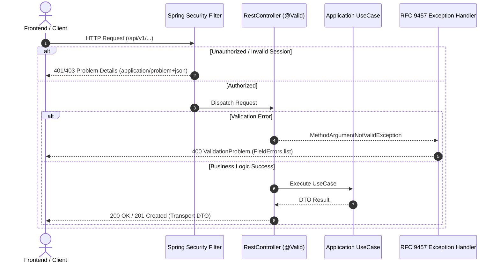

# API Conventions and OpenAPI

This document defines the HTTP API conventions and compatibility policy. The machine-readable source of truth is [`src/main/resources/static/openapi/granthalay-api-v1.yaml`](../src/main/resources/static/openapi/granthalay-api-v1.yaml).

The running application serves that exact contract at `/openapi/granthalay-api-v1.yaml` and links to it from `GET /api/v1`.

---

## Request & RFC 9457 Error Handling Flow

---

## Key Conventions

### 1. URLs & Representations
- Public endpoints live under `/api/v1`.
- JSON is the default representation; file delivery uses explicit safe media types.
- Plural nouns are used for resources (e.g. `/api/v1/books`).

### 2. Strict DTO Isolation
- Persistence entities (`@Entity`) must **never** cross the HTTP boundary.
- `HttpBoundaryTests` reflectively verifies that `@RestController` methods return and accept transport DTOs only.

### 3. Pagination
- Bounded query parameters: `page` (zero-based, default 0) and `size` (1 to 100, default 20).
- Response metadata uses `PageMetadata` (`page`, `size`, `totalElements`, `totalPages`).

### 4. RFC 9457 Problem Details
Failures use `application/problem+json`:
- `type`: Machine-readable URI identifier.
- `title` & `detail`: Safe human-readable description.
- `requestId`: Correlation identifier for auditability.
- `ValidationProblem`: Includes `errors` array with `field`, `code`, and `message` (rejected values omitted for privacy).

### 5. Client Generation & Compatibility
- Maven generates a TypeScript client (`typescript-fetch`) into `target/generated-clients/typescript`.
- `ApiContractCompatibilityTests` compares the published contract against `granthalay-api-v1-baseline.yaml` to prevent breaking changes.
