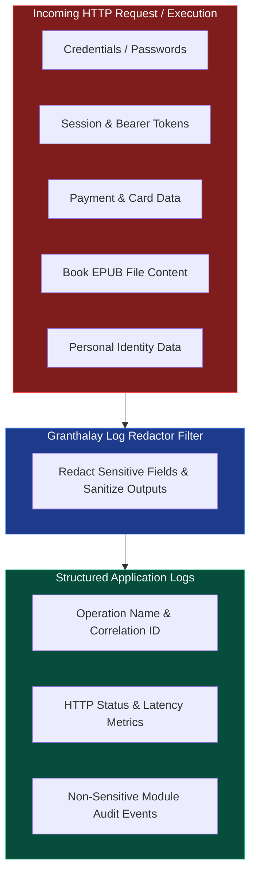
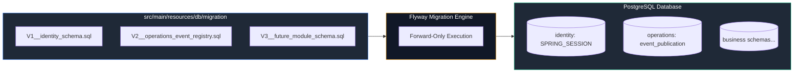

# Data Ownership and Privacy

## Zero-Logging Privacy Policy

Privacy and security boundaries are enforced strictly across logging and database storage.

### Strict Redaction Rules
1. **Never Log Secrets**: Passwords, auth tokens, session IDs, and authorization headers must never be written to logs.
2. **Never Log Payment Data**: Credit card details, bank accounts, and payment payload data stay within encrypted adapter boundaries.
3. **Never Log Book Contents**: EPUB binary data or book body text must never be logged.
4. **Never Log Raw PII**: Personal identification data (email addresses, phone numbers, full names) must not appear in diagnostic logs.

---

## Database Schema Ownership

Flyway is the **sole schema writer** for the PostgreSQL database.

### Database Migration Rules
- **Forward-Only Migrations**: Released schema changes use immutable, forward-only Flyway migrations. Never alter or delete released migration scripts.
- **Module Table Ownership**: Business modules own their database tables. Cross-module database queries are forbidden.
- **Disabled Auto-Generators**: Hibernate schema generation (`ddl-auto`), SQL script execution, and Flyway clean are disabled in all environments.
