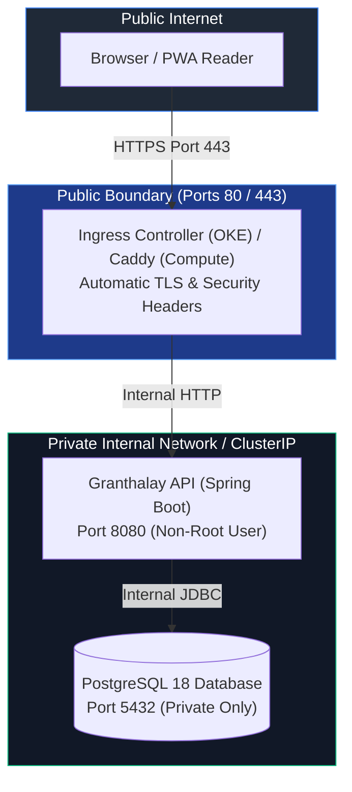

# OCI Deployment Guide

This document defines the production deployment topology and operations for **Granthalay API** on **Oracle Cloud Infrastructure (OCI)**. It supports both **OCI Kubernetes (OKE)** clusters and **OCI Compute** virtual machines (ARM64 Ampere & AMD64 free-tier instances).

---

## Deployment Topology & Network Security



1. **Public Interface**: Only HTTPS (`443`) and HTTP-to-HTTPS redirect (`80`) are exposed to the public internet via the Ingress Controller (OKE) or Caddy Reverse Proxy (Compute VM).
2. **Private Services**: PostgreSQL (`5432`) and Spring Boot (`8080`) are strictly internal, reachable only inside the Kubernetes cluster or Docker Compose network.
3. **Non-Root Execution**: The application OCI container runs as unprivileged user `granthalay`.

---

## 1. Deploying to OCI Kubernetes (OKE)

The `k8s/` directory contains declarative Kubernetes manifests:

- `k8s/kustomization.yaml`: Kustomize manifest index.
- `k8s/configmap-secret.yaml`: Application ConfigMap & Secret.
- `k8s/postgres-statefulset.yaml`: PostgreSQL 18 StatefulSet + PersistentVolumeClaim + ClusterIP Service.
- `k8s/api-deployment.yaml`: Spring Boot API Deployment + ClusterIP Service + Health Probes.
- `k8s/ingress.yaml`: HTTPS Ingress resource.

### Applying Manifests

```bash
# Apply all Kubernetes resources atomically
kubectl apply -k k8s/
```

### Rollback on OKE

To roll back to the previous deployment version:

```bash
kubectl rollout undo deployment/granthalay-api
```

To view deployment status and history:

```bash
kubectl rollout status deployment/granthalay-api
kubectl rollout history deployment/granthalay-api
```

---

## 2. Deploying to OCI Compute (Docker Compose)

For standalone OCI Compute instances (VMs):

### Initial Setup

1. Copy `.env.example` to `.env` on the host:
   ```bash
   cp .env.example .env
   ```
2. Edit `.env` to configure production secrets, allowed origins, and target domain name.

3. Start services:
   ```bash
   docker compose up -d
   ```

### Rollback on OCI Compute

To roll back to a specific image tag (e.g. `v0.1.0` or short commit SHA):

```bash
export API_IMAGE=ghcr.io/samsterzero/granthalayapi:sha-xxxxxxx
docker compose up -d api
```

---

## Secret Management & Rotation

- **Credentials & Tokens**: Database passwords, session keys, and allowed origins are injected via environment variables outside of source control (`k8s/configmap-secret.yaml` in K8s, `.env` in Compose).
- **Rotation**:
  - Update password in Secret / `.env`.
  - Update PostgreSQL user password in database.
  - Restart API pods/containers (`kubectl rollout restart deployment/granthalay-api` or `docker compose restart api`).

---

## Resource Optimization for OCI Free Tier

- **JVM RAM Tuning**: Set `JAVA_TOOL_OPTIONS="-XX:MaxRAMPercentage=75.0 -XX:InitialRAMPercentage=50.0 -XX:+UseG1GC"` to prevent OOM errors on limited memory instances.
- **Container Limits**:
  - `granthalay-api`: Request 384Mi, Limit 768Mi.
  - `postgres`: Request 256Mi, Limit 512Mi.
  - `caddy`: Request 64Mi, Limit 128Mi.
