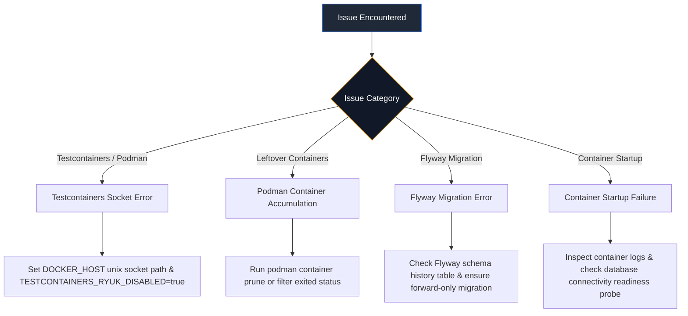

# Troubleshooting & Diagnostics

This document contains step-by-step diagnostic workflows for common local development, Testcontainers, Podman container management, and database migration issues.

---

## Troubleshooting Decision Tree



---

## 1. Testcontainers & Podman Socket Configuration

### Problem
Testcontainers integration tests fail to start PostgreSQL or error with connection refused to the Docker daemon when running on Podman.

### Fix
Expose the Podman user socket and pass it to Maven:

```bash
# Check if Podman socket exists
podman info | grep remoteSocket

# Execute Maven verify with Podman socket environment
DOCKER_HOST=unix:///run/user/$UID/podman/podman.sock TESTCONTAINERS_RYUK_DISABLED=true ./mvnw verify
```

---

## 2. Podman Stopped Containers Cleanup

### Problem
Repeated execution of integration tests leaves multiple stopped/created PostgreSQL containers (`docker.io/library/postgres:18-alpine`) in `podman ps -a`.

### Fix
Prune stopped containers without affecting active development containers:

```bash
# Prune all stopped containers safely
podman container prune

# Alternatively, remove only exited/created containers
podman rm $(podman ps -q -f status=exited -f status=created)
```

---

## 3. Flyway Migration Conflicts

### Problem
Application fails startup with `FlywayException: Validate failed: Migrations have failed validation`.

### Fix
1. **Never edit released migration files**: In `src/main/resources/db/migration`, once a migration file (e.g. `V1__...`) is committed and released, its checksum must not change.
2. **Add a forward-only migration**: Create a new version file (e.g. `V3__fix_column.sql`) to apply incremental fixes.

---

## 4. Container Health Check Diagnostics

### Problem
Container fails readiness or liveness probes during container checks.

### Diagnostics
Check container probe status and logs:

```bash
# Inspect container readiness endpoint
curl -i http://localhost:8080/actuator/health/readiness

# Inspect container liveness endpoint
curl -i http://localhost:8080/actuator/health/liveness
```

Readiness returns HTTP `200` (`STATUS: UP`) when PostgreSQL database connectivity is healthy and returns HTTP `503` (`STATUS: DOWN`) during a database outage. Liveness remains `200` during database outages to prevent unnecessary container restarts.
