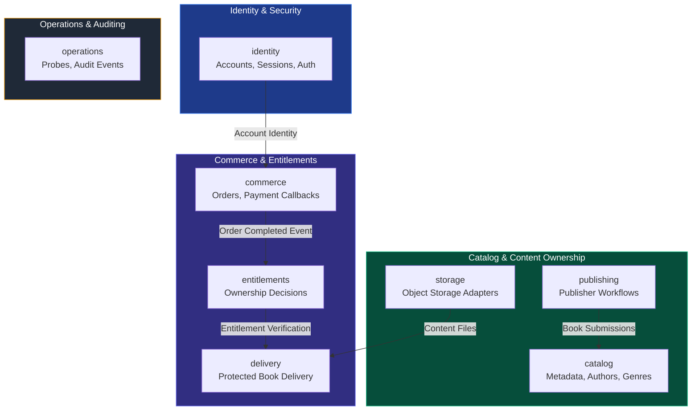

# Module Inventory & Roadmap

## Foundation Modules Overview

Issue #2 defines the eight foundation package boundaries for **Granthalay API**. The application begins as a **modular monolith** with one PostgreSQL database; business modules own their schemas and tables.

---

## Module Responsibilities

1. **`identity`**: Manages user registration, password authentication, and revocable browser sessions stored in PostgreSQL (`SPRING_SESSION`).
2. **`catalog`**: Manages book catalog metadata, search indices, author details, genres, and public catalog listings.
3. **`publishing`**: Manages publisher accounts, manuscript submissions, approval workflows, and publication metadata.
4. **`storage`**: Provides abstraction over physical book object storage (Local filesystem, S3, GCS) behind replaceable provider adapters.
5. **`commerce`**: Handles shopping carts, order creation, price calculations, and payment provider webhook processing.
6. **`entitlements`**: Evaluates digital rights and ownership rules to determine whether a user is entitled to access a specific book.
7. **`delivery`**: Delivers protected EPUB book content streams exclusively to entitled users over secure, authenticated HTTP routes.
8. **`operations`**: Exposes restricted operational health probes (`/actuator/health`), Spring Modulith event publication registries, and security-relevant audit logs.

---

## Feature Roadmap

### Phase 1: Foundation (Milestone v0.1.0)
- [x] Spring Modulith verified architecture and package allowlists.
- [x] Flyway schema migration foundation.
- [x] Versioned REST contract `/api/v1` & published OpenAPI source of truth (Issue #12).
- [x] Multi-architecture container build and OCI Kubernetes (OKE) & Compute deployment (Issue #18).

### Phase 2: User Accounts & Catalog Metadata
- [x] Implement `identity` module: User sign-up, email verification, sign-in, session management (Issue #5).
- [x] Implement secure cookie sessions, session rotation, and multi-device revocation (Issue #6).
- [x] Implement email-based password reset and automatic session revocation (Issue #15).
- [ ] Implement `catalog` module: Book search, author metadata, public listings.

### Phase 3: Commerce & Entitlements
- [ ] Implement `commerce` module: Stripe payment integration.
- [ ] Implement `entitlements` module: Purchase verification & ownership rules.

### Phase 4: Protected Delivery & Publishing
- [x] Implement `storage` module: Secure EPUB ingestion, validation, versioning, and object storage (Issue #9).
- [x] Implement `publishing` module: Publisher onboarding, team member roles, payout references, and metadata submission (Issue #13).
- [ ] Implement `delivery` module: Streamed EPUB content delivery.

---

## Service Extraction Criteria

A business module may be extracted into an independent microservice **only** when operational evidence (e.g. extreme independent scaling demand or team ownership boundaries) justifies the added operational complexity. Until then, code remains co-located inside the modular monolith.
