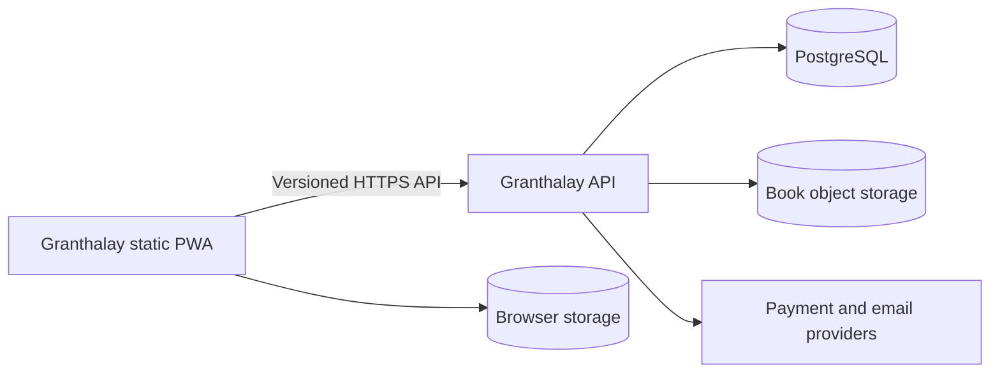

# Architecture

## System context

The PWA owns personal EPUB import, rendering, local library data, and offline reading. This API owns
optional connected features: accounts, catalog, commerce, entitlements, protected content delivery,
notifications, publisher operations, administration, and auditing.

## Deployment model

The backend is a Spring Modulith modular monolith. It is built as one OCI image and deployed
separately from the GitHub Pages frontend. Initially, modules share one PostgreSQL instance but own
their schemas or tables. External providers are replaceable adapters at the application boundary.

## Module rules

Issue #2 defines eight foundation packages: `identity`, `catalog`, `publishing`, `storage`,
`commerce`, `entitlements`, `delivery`, and `operations`. Identity covers accounts, publishing covers
publishers, and storage and delivery separate content infrastructure from protected access.
Operations reserves the boundary for operational concerns; finer boundaries can follow their use cases.

Each package declares an empty dependency allowlist. Add dependencies explicitly when introducing a
published application API or event collaboration. `ModuleArchitectureTests` checks the module inventory,
verifies the application, and confirms that a deliberately forbidden dependency is rejected.

- Each business module owns its domain model, persistence, and migrations.
- Other modules interact through explicit application APIs or domain events.
- Code outside a module cannot access that module's repositories or persistence entities.
- HTTP controllers translate transport concerns and delegate to application use cases.
- Provider-specific types do not cross adapter boundaries.
- Modulith verification tests must accompany newly introduced modules.

## Database schema ownership

Flyway is the sole schema writer. Migrations live in `src/main/resources/db/migration` and use
globally ordered versions with the owning module in the filename. `V1` creates identity's Spring
Session tables; `V2` creates operations' Spring Modulith JPA publication registry. Event completion
uses update mode; changing that mode may require an additional migration.

Hibernate validates mappings at startup. SQL script and Spring Session schema initializers are
disabled, and Flyway clean is disabled. Add forward-only migrations for future schema changes.
Integration tests use PostgreSQL 18, matching Compose, and exercise session and event persistence.

Compose mounts PostgreSQL 18 data at `/var/lib/postgresql`. If an existing local database used the
previous `/var/lib/postgresql/data` mount, back it up and migrate its data before switching mounts;
do not delete a volume containing needed data.

## Security and privacy boundaries

The production frontend origin is `https://samsterzero.github.io`; allowed origins must be explicit
configuration rather than a wildcard. Authentication will use short-lived access credentials and a
revocable refresh/session mechanism. Authorization is enforced at the use-case boundary, including
every content-delivery request.

Logs are structured and redact credentials, tokens, payment data, book contents, and personal data.
Reading telemetry is not collected by default. Database migrations are forward-only after release,
and uploaded content is treated as untrusted input.

Anonymous GET requests are limited to `/actuator/health`, `/actuator/health/liveness`,
`/actuator/health/readiness`, `/api/v1`, and the published v1 OpenAPI document. Probes expose status
only; root health also lists the two probe groups. Readiness includes database connectivity and
application availability; liveness does not depend on the database. Other routes return generic 403
Problem Details.
There is no default account or generated password, denied requests are not saved in sessions,
and CSRF protection remains enabled. Product endpoints require explicit access policies as introduced.

Credentialed CORS is scoped to `/api/**`. Origins come from
`GRANTHALAY_WEB_ALLOWED_ORIGINS`; wildcard origins are not accepted.

## Repository relationship

- Frontend: <https://github.com/SamsterZero/Granthalay>
- Backend: <https://github.com/SamsterZero/granthalayapi>

Changes to a shared API contract should link companion issues or pull requests in both repositories.
